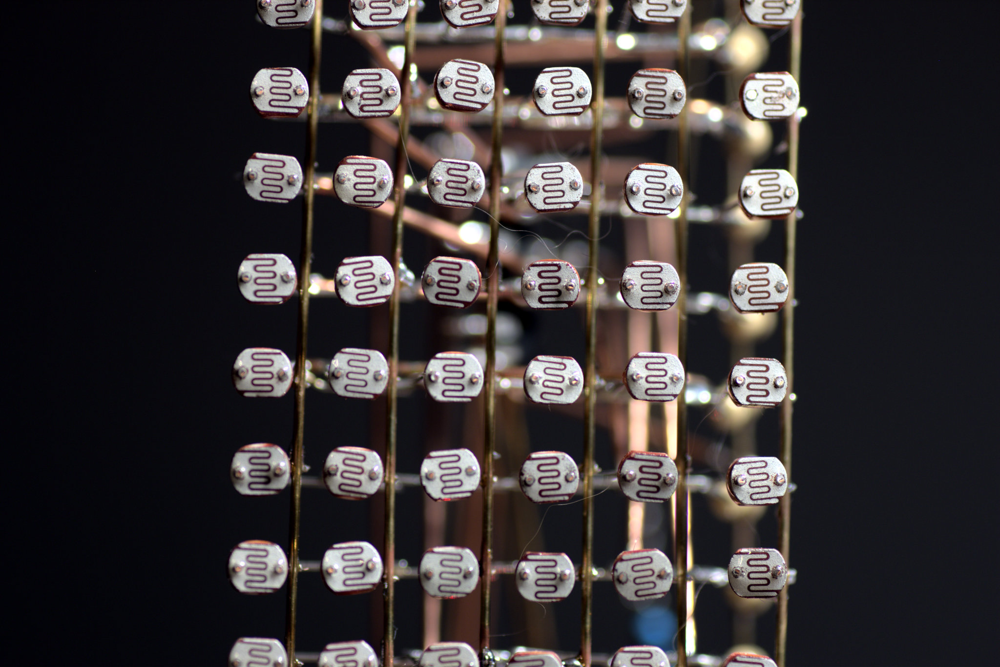
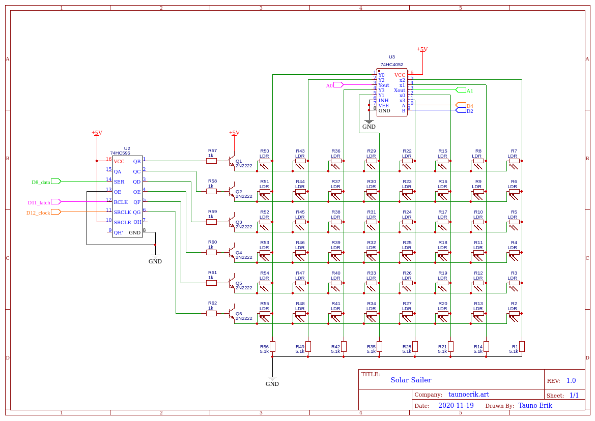
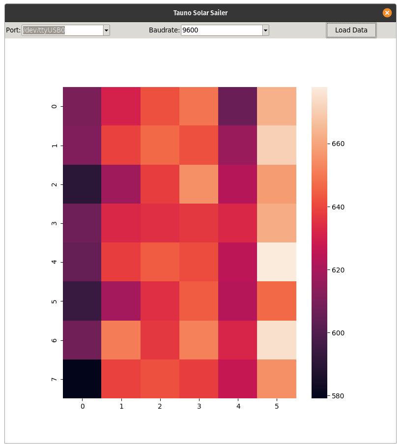
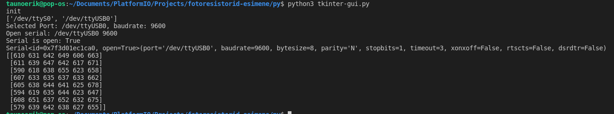

# solar-sailer

This my little project to measure light. It has 6*8 photoresistors or pixels. So I can measure 48 different values. A longer-term idea is to make small photosensor. I've done a little python script and app to display data: a heatmap graph.

It have Arduino Nano and CD4052 (not ideal) analog multiplekser. Python sends command over serial to Nano. What takes measurements and sends data back. Python scrip are tkinter, pyseria and numpy+matplotlob to draw graph. So it should to work on any os.

